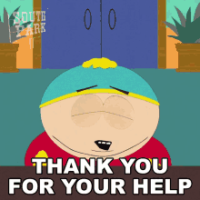

.png)

# Tic Tac Toe

## How to play

The Tic Tac game i developed is pretty self explanitory.
In order to win the player need to get 3 "X's" or "O's" in a row. The player can win diagonaly, vertically or horizontaly.

Here is a link to a YouTube video that states the rule of the game in detail. https://youtu.be/5SdW0_wTX5c

 

# How did i develop this game?
Before i started working a project i spent a day researching and brainstorming ideas. 
After i created the basic HTML file with specific Id and Class then i started calling DOM elements on my JavaScript file.

I created a class for the two players that will be playing the game. Throughout the game i ended up developing multiple functions for the game. 

Once all the necessary variables are created, i started working on their functions and inspecting my script to make sure itt is working properly.

However; i wasn't able to solve the automated assignment of values on time.

## Instruction
1. Click anywhere on the screen

2. Enter players name

3. When you click enter it will direct you to the game. 

4. You have the option to Restart the entire game / reset players by clicking 'Restart' button.
The other option is the 'Try Again' button which will let you restart just the game.

5. Throughout the game the score log will keep record of the players score.

## How to play the game 
Click the link below to play the game ...
https://bettyshawla.github.io/Tic-Tac-Toe-project-1/

# Special thank you to ...
 1. Google.com
 2. YouTube.com
 3. Canva.com
 4. Stack over flow
 5. W3.com
 6. Shout out to everyone in Group 30 

 

